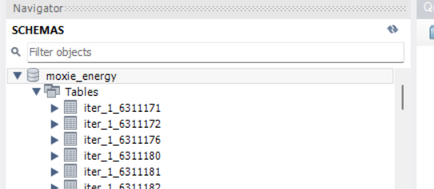
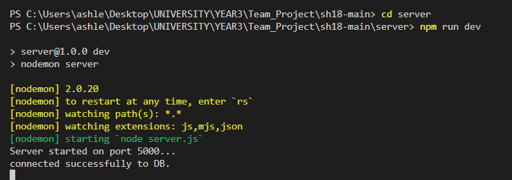

# SH18 Main

## Installation

### 1. Get The Files
Clone the git repository by running 
"git clone https://stgit.dcs.gla.ac.uk/team-project-h/2022/sh18/sh18-main.git" 
in the folder you would like to store the project.

### 2. Populate Local Database
1. Install MySQL: https://dev.mysql.com/downloads/installer/
2. Make sure the database client uses these credentials:
    host: "localhost",
    user: "root",
    password: "password",
3. Run the populateDB.py located in "server/populate_script/"
4. You should now have populated tables in your MySQL Workbench

### 3. Run The Server
1. Open a terminal located in server/
2. Run "npm i" to install all packages and dependencies 
3. Run "npm run dev" to start the server

### 4. Run The Application
1. Open a terminal located in client/
2. Run "npm i" to install all packages and dependencies 
3. Run "npm run dev" to start the server

3. The application should now be running on the address specified in the console

## Name

Moxie Energy - Energy Forecast & Recommendations

## Description

Let people know what your project can do specifically. Provide context and add a link to any reference visitors might be unfamiliar with. A list of Features or a Background subsection can also be added here. If there are alternatives to your project, this is a good place to list differentiating factors.
 This project is designed to read a group of energy meters and display them alongside the cost of power at that time, and using this data advise the user as to when electricity is costing them the most money

## Visuals

Depending on what you are making, it can be a good idea to include screenshots or even a video (you'll frequently see GIFs rather than actual videos). Tools like ttygif can help, but check out Asciinema for a more sophisticated method.

## Usage

Use examples liberally, and show the expected output if you can. It's helpful to have inline the smallest example of usage that you can demonstrate, while providing links to more sophisticated examples if they are too long to reasonably include in the README.

## Support

Tell people where they can go to for help. It can be any combination of an issue tracker, a chat room, an email address, etc.

## Authors and acknowledgment

Show your appreciation to those who have contributed to the project.

## License

For open source projects, say how it is licensed.
