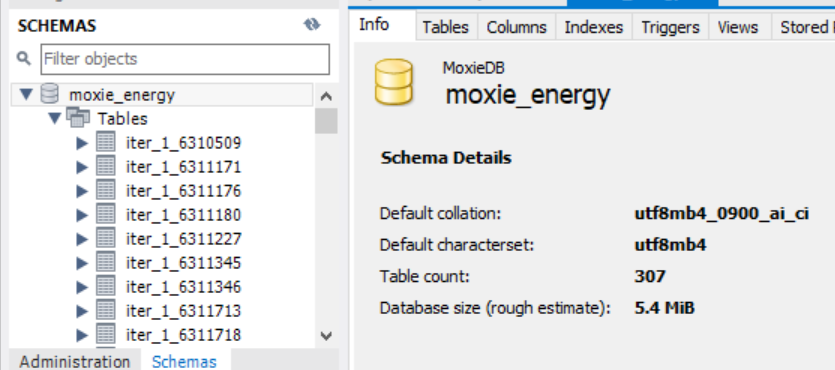

# SH18 Main

## Installation

### 1. Get The Files
Clone the git repository by running 
"git clone https://stgit.dcs.gla.ac.uk/team-project-h/2022/sh18/sh18-main.git" 
in the folder you would like to store the project.

### 2. Populate Local Database
The project has been set up to store all information received from
our energy API in a local database.
1. Install MySQL Workbench: https://dev.mysql.com/downloads/workbench/
2. Check to see you have the appropriate python packages installed
(mysqlclient and mysql-connector-python) in a command terminal by running
"pip freeze". If not, run "pip install {name of package}" 
3. Open MySQL Workbench and hit the plus icon. This will create a pop-up where you 
will enter a database name of your choice but the username must be "root", the hostname
must be "127.0.0.1" (localhost), and you must add a password by selecting "store
in vault" and type in "password". This allows the python scripts to communicate with 
the database.
4. Once the local database is live, navigate to "server/populate_script/" and run the file "offlinePopulateDB.py". Execution time of this should be no longer than 90 seconds.
5. When finished, check the script has ran successfully by checking the information of the schema, which should
have 307 tables storing 48 hours of data starting from 72 hours ago.
6. Next run "offlineUpdateDB.py" to add the most recent 24 hours of data to all iterations. From now on, this will be the only script you have to run in order to get new data.

### 3. Run The Server
1. Open a terminal located in server/
2. Run "npm i" to install all packages and dependencies 
3. Run "npm run dev" to start the server

### 4. Run The Application
1. Open a terminal located in client/
2. Run "npm i" to install all packages and dependencies 
3. Run "npm run dev" to start the server

3. The application should now be running on the address specified in the console

## Name

Moxie Energy - Energy Forecast & Recommendations

## Description

Moxie Energy - Energy Forecast & Recommendations is a web application that imports the energy usage (in kwh) of an organisation, currently working with data from the University of Glasgow, and compares the energy usage with wholesale energy prices. It then uses these prediction models and data analysis methods to recommend different ways to manipulate energy usage to save money per sensor.

### Current Features:
- Import energy usage data from all sensors in the Univeristy of Glasgow
- Refine data by dates and time intervals
- Display energy usage data from multiple sensors on the same graph
- Visualize energy usage data using a Bar Chart and an Area Chart
- Retreive energy wholesale prices and the date-time they are peaking

## Visuals

## Support

If support is needed while setting up or using the application please message any/all of the developers in the Teams channel.

## Authors and acknowledgment

### Moxie Energy Founders
- Adrian Jonas
- William Aynsley

### Developers
- Petros Kitazos
- Ashleen Daly
- Adam Templeton
- Rory McDermid
- Boyang Li
- Parv Gulhati

### Coach
- Nicholas Callander

## License

This project is licensed using the MIT Open Source License.
