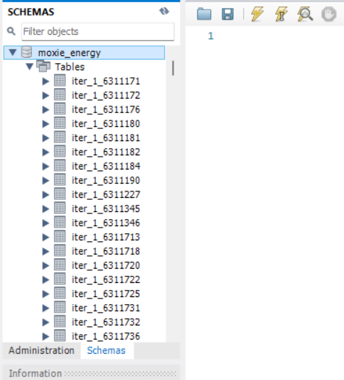
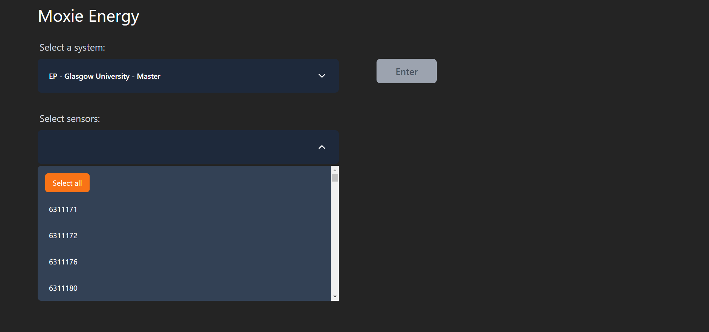
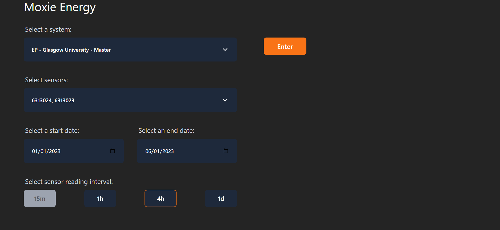
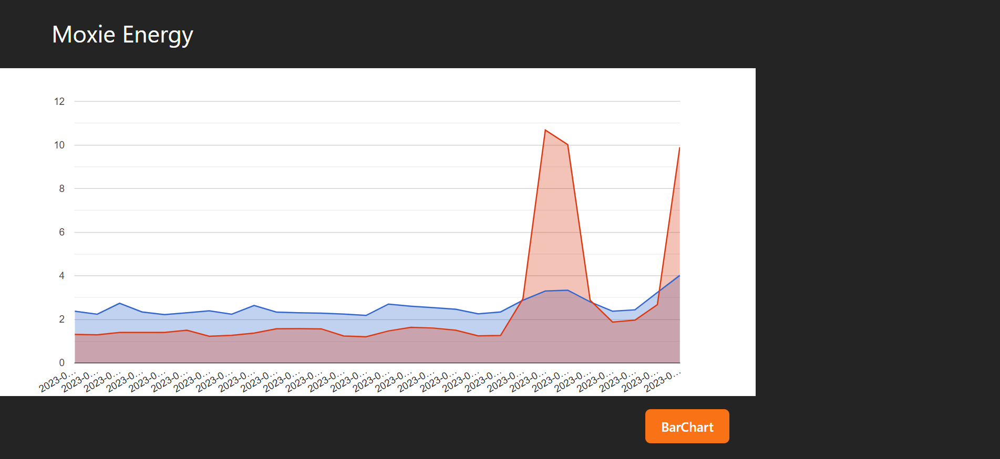
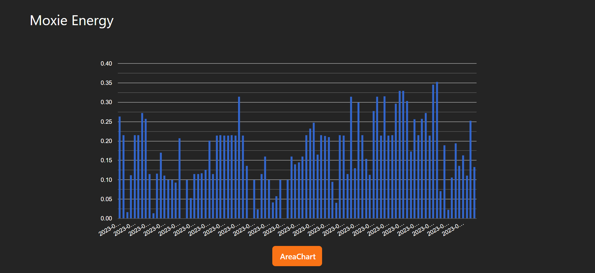

# SH18 Main

## Installation

### 1. Get The Files
Clone the git repository by running 
"git clone https://stgit.dcs.gla.ac.uk/team-project-h/2022/sh18/sh18-main.git" 
in the folder you would like to store the project.

### 2. Populate Local Database
1. Install MySQL: https://dev.mysql.com/downloads/installer/
2. Make sure the database client uses these credentials:
    host: "localhost",
    user: "root",
    password: "password",
3. Run the populateDB.py located in "server/populate_script/"
4. You should now have populated tables in your MySQL Workbench

### 3. Run The Server
1. Open a terminal located in server/
2. Run "npm i" to install all packages and dependencies 
3. Run "npm run dev" to start the server

### 4. Run The Application
1. Open a terminal located in client/
2. Run "npm i" to install all packages and dependencies 
3. Run "npm run dev" to start the server

3. The application should now be running on the address specified in the console

## Name

Moxie Energy - Energy Forecast & Recommendations

## Description

Moxie Energy - Energy Forecast & Recommendations is a web application that imports the energy usage (in kwh) of an organisation, currently working with data from the University of Glasgow, compares the energy usage with wholesale energy prices and uses machine learning models to predict future energy consumption and wholesale prices. It then uses these predictions and a combination of data analysis methods to recommend different ways to manipulate data usage to save money on energy.

### Current Features:
- Import energy usage data from all sensors in the Univeristy of Glasgow
- Refine data by dates and time intervals
- Display energy usage data from multiple sensors on the same graph
- Visualize energy usage data using a Bar Chart and an Area Chart
- Retreive energy wholesale prices and the date-time they are peaking

## Visuals

## Usage

Use examples liberally, and show the expected output if you can. It's helpful to have inline the smallest example of usage that you can demonstrate, while providing links to more sophisticated examples if they are too long to reasonably include in the README.

## Support

Tell people where they can go to for help. It can be any combination of an issue tracker, a chat room, an email address, etc.

## Authors and acknowledgment

Show your appreciation to those who have contributed to the project.

## License

For open source projects, say how it is licensed.
