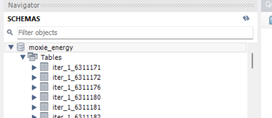
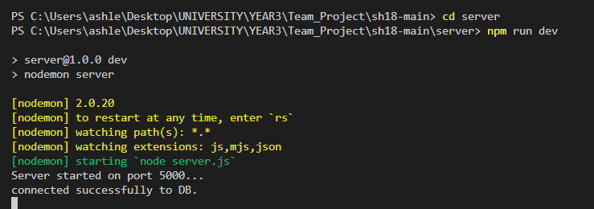
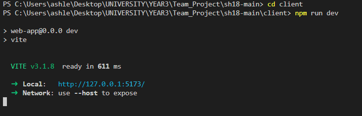
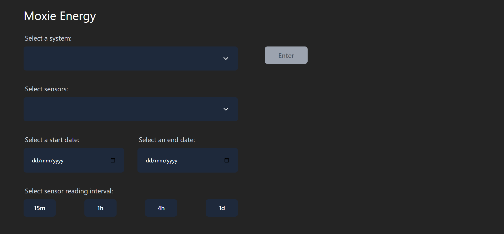
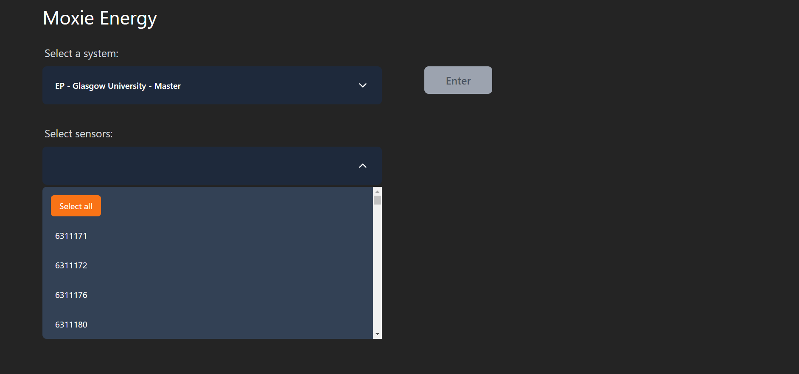
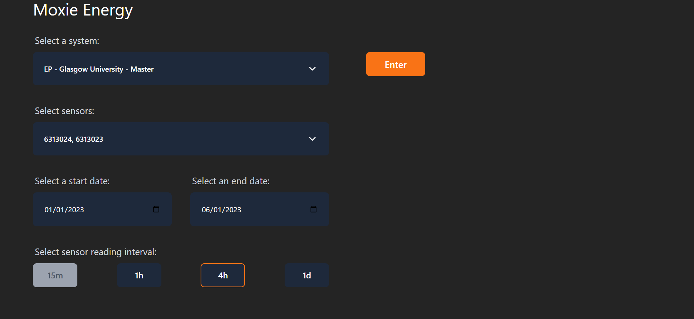
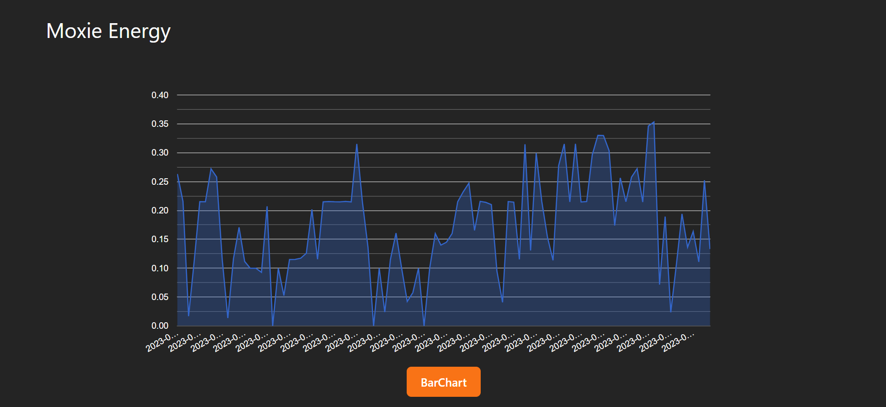
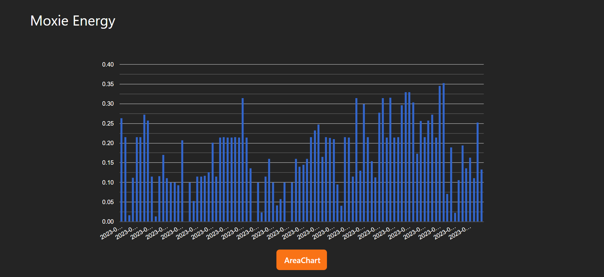

# SH18 Main

## Installation

### 1. Get The Files
Clone the git repository by running 
"git clone https://stgit.dcs.gla.ac.uk/team-project-h/2022/sh18/sh18-main.git" 
in the folder you would like to store the project.

### 2. Populate Local Database
1. Install MySQL: https://dev.mysql.com/downloads/installer/
2. Make sure the database client uses these credentials:
    host: "localhost",
    user: "root",
    password: "password",
3. Run the populateDB.py located in "server/populate_script/"
4. You should now have populated tables in your MySQL Workbench

### 3. Run The Server
1. Open a terminal located in server/
2. Run "npm i" to install all packages and dependencies 
3. Run "npm run dev" to start the server

### 4. Run The Application
1. Open a terminal located in client/
2. Run "npm i" to install all packages and dependencies 
3. Run "npm run dev" to start the server

3. The application should now be running on the address specified in the console

## Name

Moxie Energy - Energy Forecast & Recommendations

## Description

Moxie Energy - Energy Forecast & Recommendations is a web application that imports the energy usage (in kwh) of an organisation, currently working with data from the University of Glasgow, and compares the energy usage with wholesale energy prices. It then uses these prediction models and data analysis methods to recommend different ways to manipulate energy usage to save money per sensor.

### Current Features:
- Import energy usage data from all sensors in the Univeristy of Glasgow
- Refine data by dates and time intervals
- Display energy usage data from multiple sensors on the same graph
- Visualize energy usage data using a Bar Chart and an Area Chart
- Retreive energy wholesale prices and the date-time they are peaking

## Visuals

## Support

If support is needed while setting up or using the application please message any/all of the developers in the Teams channel.

## Authors and acknowledgment

### Moxie Energy Founders
- Adrian Jonas
- William Aynsley

### Developers
- Petros Kitazos
- Ashleen Daly
- Adam Templeton
- Rory McDermid
- Boyang Li
- Parv Gulhati

### Coach
- Nicholas Callander

## License

This project is licensed using the MIT Open Source License.
